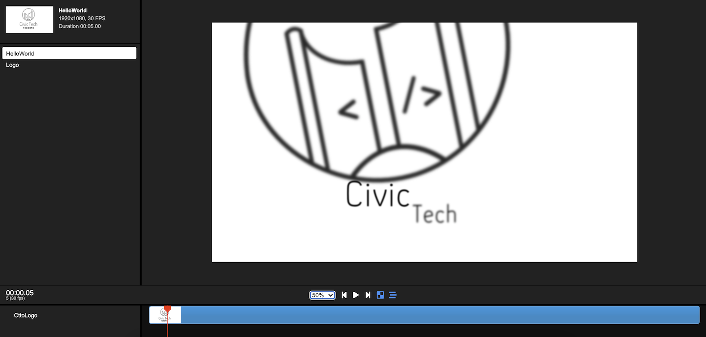
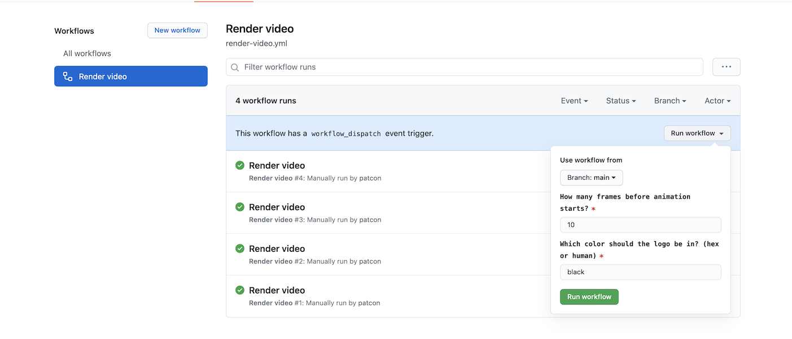

# Remotion video: Civic Tech Toronto

<p align="center">
  <a href="https://github.com/patcon/civictechto-animation">
    
  </a>
</p>

Welcome to your Remotion project! Remotion is a tool for creating video animations completely in ReactJS.

This project generates an intro animation for Civic Tech Toronto video content. [Download a sample video of the generated animation.](https://drive.google.com/uc?id=1JDUGL2VLidpySfN1iVrVeqAHXg8F4RAi&authuser=0&export=download)

## Commands

**Start Preview**

```console
npm start
```

**Render video**

```console
npm run build
```

**GitHub Render**

1. Visit the [page for "Render video" workflow](https://github.com/patcon/civictechto-animation/actions/workflows/render-video.yml),
2. open the "Run workflow" dropdown (requires appropriate access on repo),
    - <details>
      <summary>Click for screenshot...</summary>

      
      </details>
3. set any inputs (use `main` branch), and
4. click the "Run workflow" button to start!

Your video will appear as an "artifact" on the workflow run when completed ([example](https://github.com/patcon/civictechto-animation/actions/runs/887509747)).

**Server render demo**

```console
npm run server
```

See [docs for server-side rendering](https://www.remotion.dev/docs/ssr) here.

**Upgrade Remotion**

```console
npm run upgrade
```

## Docs

Get started with Remotion by reading the [fundamentals page](https://www.remotion.dev/docs/the-fundamentals).

## Issues

Found an issue with Remotion? [File an issue here](https://github.com/JonnyBurger/remotion/issues/new).

## License

Notice that for some entities a company license is needed. Read [the terms here](https://github.com/JonnyBurger/remotion/blob/main/LICENSE.md).
